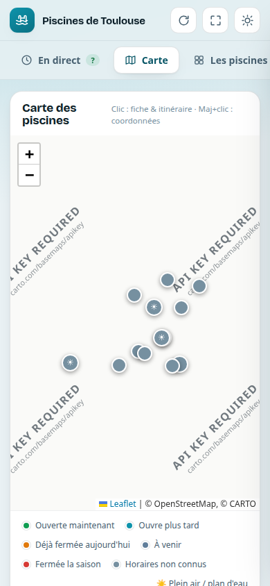
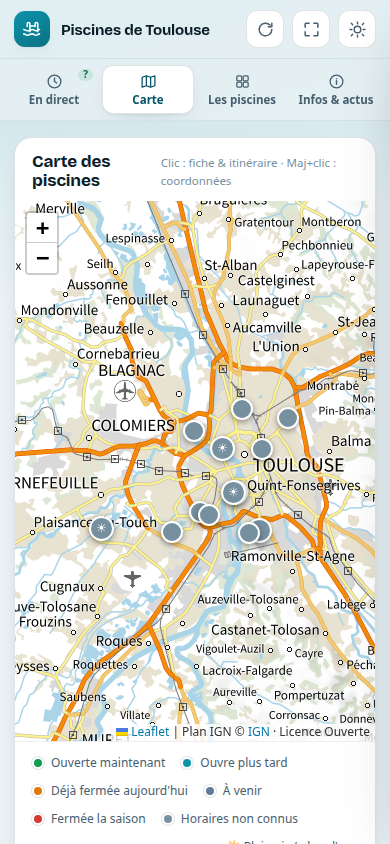

# Comment ce projet est construit

SPool affiche l'état des piscines municipales de Toulouse sur téléphone. C'est un petit site
statique, sans serveur. Il est tenu par **des agents Claude** : une tâche planifiée dans le cloud,
et des sessions sur le PC de Maxime. Maxime parle, Claude fait, et une poignée de vérifications
garantissent ce qui compte ici.

Ce document explique **ce qui est vérifié, pourquoi dans ce projet, et ce qui n'a volontairement
pas été installé.**

---

## Ce qui compte ici : l'appli ne doit jamais mentir

Quelqu'un regarde son téléphone, lit « Ouverte », prend son vélo, et trouve porte close. C'est
le seul vrai risque du projet. Tout le setup en découle.

**L'histoire qui a fixé la forme du setup (28/09/2026).** L'appli affichait « Fermée » pour les 13
piscines et « 0 ouverte ». En même temps, la vérification existante répondait « ✓ Données
valides ». Elle contrôlait la *forme* des données (dates bien écrites, coordonnées dans Toulouse),
jamais *ce que l'appli en affiche*. Or aucun horaire de l'année n'était encodé : l'appli
traduisait « je ne sais pas » par « Fermée ».

| Avant (en ligne le matin du 28/09) | Après (publié le 28/09, 11 h 46) |
|---|---|
|  |  |

La nouvelle vérification, lancée sur l'ancien code, a trouvé **364 affichages faux** : 13
piscines × 14 jours × 2 heures testées ([sortie complète](preuves/check-avant-2026-09-28.txt)).
Après correction : zéro.

**La deuxième leçon (28–29/09) : un contrôle vert n'est pas ce que voit la personne.** Une revue
extérieure a trouvé en ligne une carte sans rues, alors que trois contrôles étaient verts. Le
fournisseur de carte répondait « 200 OK » avec la même image de refus partout : le contrôle
vérifiait que la carte « se charge », pas qu'elle montre une carte. Depuis la v4, les contrôles
regardent ce que le navigateur reçoit et affiche vraiment : les images des tuiles, le texte
visible à 390 px, le contenu du cache du téléphone.

| Carte avant (28/09) | Carte après (v4, en ligne le 29/09) |
|---|---|
|  |  |

---

## Plan d'ensemble

```
index.html            l'appli entière (police, carte Leaflet, données, calcul, affichage)
  ├─ let META/ALERT/NEWS/POOLS   ← blocs de DONNÉES (la tâche cloud n'édite que ça)
  └─ MOTEUR                      ← le calcul « ouverte / fermée / non connue »
data.json             copie des données, rechargée par les applis installées (toutes les 15 min)
sw.js                 hors-ligne ; sert index.html depuis son cache → nom de cache à changer à chaque modif du code
sources/mairie/       dernière version VALIDÉE de chaque fiche officielle (texte) — l'historique git = la preuve
tools/
  check.mjs           vérifie les données ET ce que l'appli affichera sur 14 jours   (Node seul)
  export-data.mjs     régénère data.json                                           (Node seul)
  sources/mairie.mjs  COLLECTE : télécharge les fiches officielles, en extrait le texte
  compare-sources.mjs COMPARE : fiche d'aujourd'hui vs dernière version validée
  publish.mjs         publie seulement si tout passe
  render.mjs          captures d'écran + erreurs JavaScript (navigateur)
  map-align-test.mjs  carte : vraies tuiles (images différentes) + marqueurs bien placés (navigateur)
  screen-test.mjs     écran à 390 px : phrases justes, onglets, textes coupés, curseur, textes piégés (navigateur)
  sw-test.mjs         cache du téléphone : contenu, mise à jour, hors ligne (navigateur + petit serveur local)
  refresh-instructions.md   feuille de mission de la tâche cloud (ne pas déplacer)
CLAUDE.md             règles et gestes pour les sessions Claude
docs/IDEES.md         feuille de route, et tout ce qui n'a pas été construit
docs/MESURES.md       ce que les contrôles ont trouvé, sabotages exprès, chrono
docs/preuves/         sorties brutes et captures, avant / après
```

**Qui fait quoi**

| Acteur | Fait | Ne peut pas |
|---|---|---|
| Tâche planifiée Claude (cloud, hebdomadaire) | tient à jour l'alerte et les actus par recherche web, `export-data` + `check`, pousse ; **signale** les horaires qui semblent avoir changé | modifier un horaire (règle depuis le 29/09) ; lire le site de la Mairie (bloqué depuis le cloud) ; faire `npm install` |
| Claude sur le PC de Maxime | lit la Mairie (`compare`), corrige, fait des captures, publie après accord | publier sans l'accord de Maxime |
| GitHub Pages | sert la branche `claude/toulouse-pools-dashboard-31xhxb` | — |
| Téléphones | rechargent `data.json` ; reçoivent le nouveau code au plus tard à la 2ᵉ ouverture après un changement du nom de cache de `sw.js` | lire des données faites pour une appli plus récente (`META.minApp`) : ils passent alors en « non connus » |

---

## Les pièces installées, et ce que chacune garantit

Chaque pièce garantit une chose précise. Elle a un test qui la fait échouer exprès, lancé une
fois lors de l'installation. Elle a aussi un critère de retrait : on la retire quand elle ne sert
plus.

### 1. Affichage honnête — dans `tools/check.mjs`
- **Garantit** : sur les 14 prochains jours, aucune piscine n'affiche « Fermée » sans fermeture
  connue. Une fermeture est connue quand une période d'horaires couvre ce jour (un dimanche hors
  des jours d'ouverture, par exemple), ou quand la piscine est `closedInSummer` pendant la saison.
  Tout le reste s'affiche « horaires non connus » avec le lien officiel. Et au-delà de **10 jours**
  sans mise à jour des données, tout passe en « non connus ».
- **Pourquoi ici** : c'est exactement la panne du 28/09. Le seuil de 10 jours répond à une autre
  panne réelle : la tâche cloud est restée muette deux mois (sa session était suspendue), et
  l'appli a continué d'afficher l'alerte canicule de juillet.
- **Comment** : le script lit le bloc `MOTEUR` d'index.html et le fait tourner jour par jour.
  Il teste donc le vrai code de l'appli, pas une copie. Node seul, sans dépendance, pour que la
  tâche cloud puisse le lancer.
- **Lancée par** : la tâche cloud (déjà prévue dans sa feuille de mission), `npm run publish`,
  Claude après chaque modification.
- **Tests d'échec exprès** : l'ancien code → 364 cas refusés. Le seuil passé à 30 jours + une
  piscine avec horaires sur un mois → refusé (« Ouverte alors que les données ont 11 jours »).
- **Aussi (v4)** : les textes des données ne contiennent ni `<` ni `>`, et les liens restent sur
  le site de la Mairie (ils sont écrits en partie par un robot d'après le web) ; `META.minApp` est
  présent et ne dépasse pas la version de l'appli ; `data.json` est exactement les blocs
  d'index.html (les téléphones lisent `data.json`).
- **Retrait** : si le calcul des horaires sort d'index.html avec ses propres tests.

### 2. Comparaison avec la Mairie — `npm run compare`
- **Garantit** : un changement sur une fiche officielle, un lien mort ou une piscine absente de
  SPool ne passe jamais inaperçu.
- **Pourquoi ici** : la seule vérité, ce sont les fiches de la Mairie, en texte libre, au format
  différent d'une piscine à l'autre. L'open data ne donne que les emplacements. Le cloud ne sait
  pas les lire, ce PC si.
- **Comment** : deux morceaux séparés exprès. `tools/sources/mairie.mjs` ne fait que **collecter**
  (télécharger, extraire le texte). `compare-sources.mjs` **compare** à la dernière version
  validée, dans `sources/mairie/`. Une autre source plus tard (open data, cloud) sera un autre
  fichier dans `tools/sources/`, avec la même forme de résultat. La comparaison ne change pas.
  L'outil ne modifie jamais les données : Claude lit l'écart, corrige avec Maxime, puis valide
  (`--accept`).
- **Lancée par** : Claude sur ce PC, quand Maxime dit « vérifie les piscines ».
- **Test d'échec exprès** : une ligne modifiée dans `sources/mairie/papus.txt` → signalée
  (« − Samedi : 9h30 - 17h / + Samedi : 9h30 - 15h »), sortie en erreur.
- **Retrait** : si la Métropole publie les horaires en open data. On remplace alors la source, pas
  la comparaison.

### 3. Publication vérifiée — `npm run publish`
- **Garantit** : rien ne part de ce PC vers les téléphones sans vérification. Et une modification
  du code atteint vraiment les applis installées.
- **Pourquoi ici** : `sw.js` sert index.html depuis son cache. Sans nouveau nom de cache, une
  correction serait en ligne mais invisible sur les téléphones. Autre raison : la tâche cloud
  pousse sur la même branche, donc on récupère d'abord ses envois et on vérifie l'ensemble.
- **Comment** : arbre propre → `git pull --rebase` → `check` → `render` → `map-test` →
  `screen-test` → `sw-test` → si le code
  d'index.html a changé, le nom de cache de `sw.js` doit avoir changé → `git push`.
  `-- --dry-run` fait tout sauf l'envoi.
- **Lancée par** : Claude, seulement après l'accord de Maxime.
- **Tests d'échec exprès** (sur une copie jetable du dépôt) : retouche du code sans nouveau cache →
  refusé ; piscine placée à Paris → refusé ; modification non commitée → refusé ; vraie
  correction → accepté.
- **Retrait** : si la publication passe un jour par une GitHub Action qui vérifie avant de
  déployer (voir [IDEES.md](IDEES.md)).

### 4. La carte montre une carte — `tools/map-align-test.mjs`
- **Garantit** : le fond de carte est fait de vraies images, et les marqueurs sont à leur place.
- **Pourquoi ici** : la panne du 28/09 au soir (18 tuiles, 1 seule image « API KEY REQUIRED »).
- **Comment** : relève les tuiles réellement reçues par le navigateur, une fois la couche de fond
  chargée (pas une attente fixe) ; refuse si aucune n'arrive ou si plus de la moitié sont la même
  image. Jamais « rien à signaler » par défaut.
- **Lancée par** : `npm run publish`.
- **Tests d'échec exprès** : l'ancien fournisseur → refusé (1 image pour 18 tuiles) ; adresse des
  tuiles cassée → refusé (« Aucune tuile reçue »).
- **Retrait** : si la carte disparaît de l'appli.

### 5. L'écran ne dit pas plus que ce que l'appli sait — `tools/screen-test.mjs`
- **Garantit**, à 390 px de large :
  - à trois moments (en saison ; lendemain de la mise à jour ; données périmées), aucune phrase
    visible ne contredit l'état : pas de canicule sans alerte, pas d'« été » hors saison, pas
    d'« aucune » ni de « 0 ouverte » quand des horaires sont inconnus, pas de numéro sans source ;
  - les 4 onglets entrent dans l'écran, et aucun état n'est coupé ;
  - le curseur clavier reste en place quand l'écran se recalcule ;
  - des données piégées, reçues par la porte d'entrée des données distantes, s'affichent comme
    du texte ;
  - une appli trop ancienne pour les données passe en « non connus ».
- **Pourquoi ici** : chaque règle correspond à un défaut trouvé en ligne (voir
  [MESURES.md](MESURES.md)).
- **Lancée par** : `npm run publish`.
- **Tests d'échec exprès** : la version d'avant → 20 refus ; neutralisation des textes désactivée,
  tableau réécrit sans garder le curseur, numéro sans source remis → refusés un par un.
- **Retrait** : une règle de phrase part quand la phrase qu'elle surveille n'existe plus dans
  l'appli.

### 6. Le cache du téléphone — `tools/sw-test.mjs`
- **Garantit** :
  - rien d'un autre site n'est gardé par le service worker, et une seule copie de `data.json` ;
  - une nouvelle version s'affiche au plus tard à la 2ᵉ ouverture ;
  - l'appli s'ouvre hors ligne.
- **Pourquoi ici** : l'ancien cache figeait l'image de refus de la carte, et bloquait les
  téléphones installés sur leur ancienne version (jamais mise à jour en 3 ouvertures).
- **Comment** : sert le site en HTTP, avec le même délai de cache que GitHub Pages (10 min). Ouvre
  la carte, actualise 5 fois, puis publie une « nouvelle version » sur ce serveur local et compte
  les ouvertures nécessaires.
- **Lancée par** : `npm run publish`.
- **Tests d'échec exprès** : l'ancien `sw.js` → 4 refus ; installation sans contourner le cache du
  navigateur → refusé ; autres sites de nouveau en cache → refusé.
- **Retrait** : si l'appli cesse d'être installable (plus de `sw.js`).

### 7. Règles et gestes — `CLAUDE.md`
Six règles courtes :
1. ne jamais afficher un état faux ;
2. ne jamais casser la tâche cloud ;
3. publier seulement par `npm run publish`, après accord ;
4. les données viennent des fiches officielles ;
5. le robot signale les horaires, il ne les modifie pas ;
6. ne jamais ajouter d'outil sans garantie précise.

S'y ajoute le tableau « Maxime dit → Claude fait » (ci-dessous).

---

## Ce qui n'a PAS été installé, et pourquoi

| Pas installé | Pourquoi |
|---|---|
| Framework de tests (Jest, Vitest…) | Des vérifications en Node suffisent. La tâche cloud tourne sans `npm install`. |
| Linter, formatteur | Un seul fichier, avec des librairies minifiées dedans : beaucoup de bruit pour peu de gain. |
| GitHub Actions / déploiement vérifié | Il faudrait changer le réglage de GitHub Pages du compte. Ce sera utile quand l'appli sera publique → [IDEES.md](IDEES.md). |
| Notifications « la tâche cloud est muette » | Choix de Maxime : l'appli se protège seule. Le seuil de 10 jours rend la panne visible dans l'appli elle-même. |
| Crochet git (pre-push) | Ni Maxime ni la tâche cloud n'en profiteraient. `npm run publish` suffit. |
| Tâche planifiée sur le PC | La comparaison se lance à la demande. On verra si l'oubli devient un problème. |
| Lecture automatique des horaires Mairie → données | Format trop variable. Claude lit l'écart et corrige : plus sûr → [IDEES.md](IDEES.md). |
| Framework web, serveur, compte à créer | Le projet est petit. Le setup doit le rester. |
| Politique de sécurité du contenu (CSP) | Tout est dans un seul fichier, scripts compris : une CSP devrait autoriser le code en ligne, et ne protégerait presque rien. La protection est ailleurs : textes neutralisés à leur entrée, et refusés dans les données par `check`. |

**Limite connue** : `check`, qui tourne dans le cloud, ne voit que le calcul (`MOTEUR`), pas
l'affichage. Ce qui est calculé dans l'affichage, comme le compteur du haut ou les phrases,
n'est surveillé que par `screen-test`, sur le PC, à chaque publication. Un envoi du robot ne
passe donc pas par `screen-test` : c'est la raison de la future « porte GitHub » (voir
[IDEES.md](IDEES.md)).

---

## Décisions de Maxime

| Date | Décision |
|---|---|
| 28/09 | L'appli sert d'abord à Maxime et ses proches ; un usage public, puis un contact avec la Métropole, viendront si ça se passe bien. |
| 28/09 | Quand les données sont fausses ou trop vieilles, l'appli se protège seule (« horaires non connus »), sans système d'alerte. Seuil : 10 jours. |
| 28/09 | La collecte des données reste séparée, pour pouvoir changer de source (open data, cloud, Métropole). |
| 28/09 | Maxime parle à Claude ; Claude publie seulement après son accord. |
| 28/09 | La session cloud « multi-créneaux » est abandonnée. |
| 28/09 | Commits sous son adresse GitHub privée (noreply), pour ce dépôt seulement. |
| 28/09 | Publier « horaires non connus » (11 h 46), puis la documentation (11 h 51). |
| 29/09 | Fond de carte : Plan IGN (service public, sans clé ni compte, Licence Ouverte, crédit affiché). |
| 29/09 | Le robot du cloud ne modifie plus aucun horaire : il le signale. |
| 29/09 | Publier la v4, avec les nouvelles formulations des phrases (12 h 25). Vérifiée sur son téléphone : « tout est bon ». |

---

## Mode d'emploi pour Maxime

| Je veux… | Je dis à Claude… |
|---|---|
| savoir si les données sont justes | « vérifie les piscines » |
| changer quelque chose dans l'appli | « change X » (puis « montre-moi ») |
| voir le résultat avant de publier | « montre-moi » |
| mettre en ligne | « publie » |
| garder une idée pour plus tard | « note l'idée : … » |

Commandes, pour mémoire : `npm run check` · `npm run compare` · `npm run render` · `npm run serve`
· `npm run publish` (voir `CLAUDE.md`).
