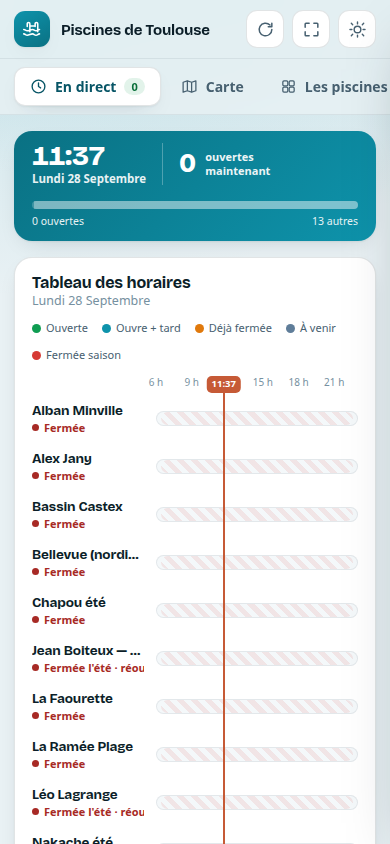
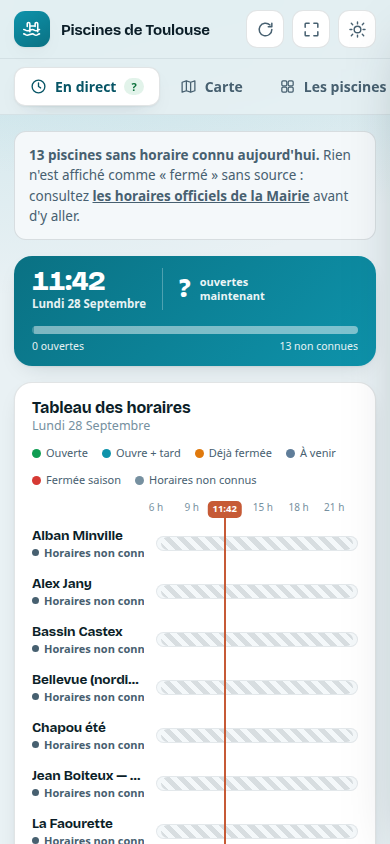

# Comment ce projet est construit

SPool affiche l'état des piscines municipales de Toulouse sur téléphone. C'est un petit site
statique, sans serveur. Il est tenu par **des agents Claude** : une tâche planifiée dans le cloud,
et des sessions sur le PC de Maxime. Maxime parle, Claude fait, et une poignée de vérifications
garantissent ce qui compte ici.

Ce document explique **ce qui est vérifié, pourquoi dans ce projet, et ce qui n'a volontairement
pas été installé.**

---

## Ce qui compte ici : l'appli ne doit jamais mentir

Quelqu'un regarde son téléphone, lit « Ouverte », prend son vélo, et trouve porte close. C'est
le seul vrai risque du projet. Tout le setup en découle.

**L'histoire qui a fixé la forme du setup (28/09/2026).** L'appli affichait « Fermée » pour les 13
piscines et « 0 ouverte ». En même temps, la vérification existante répondait « ✓ Données
valides ». Elle contrôlait la *forme* des données (dates bien écrites, coordonnées dans Toulouse),
jamais *ce que l'appli en affiche*. Or aucun horaire de l'année n'était encodé : l'appli
traduisait « je ne sais pas » par « Fermée ».

| Avant (en ligne le matin du 28/09) | Après (publié le 28/09, 11 h 46) |
|---|---|
|  |  |

La nouvelle vérification, lancée sur l'ancien code, a trouvé **364 affichages faux** : 13
piscines × 14 jours × 2 heures testées ([sortie complète](preuves/check-avant-2026-09-28.txt)).
Après correction : zéro.

---

## Plan d'ensemble

```
index.html            l'appli entière (police, carte Leaflet, données, calcul, affichage)
  ├─ let META/ALERT/NEWS/POOLS   ← blocs de DONNÉES (la tâche cloud n'édite que ça)
  └─ MOTEUR                      ← le calcul « ouverte / fermée / non connue »
data.json             copie des données, rechargée par les applis installées (toutes les 15 min)
sw.js                 hors-ligne ; sert index.html depuis son cache → nom de cache à changer à chaque modif du code
sources/mairie/       dernière version VALIDÉE de chaque fiche officielle (texte) — l'historique git = la preuve
tools/
  check.mjs           vérifie les données ET ce que l'appli affichera sur 14 jours   (Node seul)
  export-data.mjs     régénère data.json                                           (Node seul)
  sources/mairie.mjs  COLLECTE : télécharge les fiches officielles, en extrait le texte
  compare-sources.mjs COMPARE : fiche d'aujourd'hui vs dernière version validée
  publish.mjs         publie seulement si tout passe
  render.mjs          captures d'écran + erreurs JavaScript (navigateur)
  map-align-test.mjs  marqueurs de la carte bien placés (navigateur)
  refresh-instructions.md   feuille de mission de la tâche cloud (ne pas déplacer)
CLAUDE.md             règles et gestes pour les sessions Claude
docs/IDEES.md         feuille de route, et tout ce qui n'a pas été construit
docs/MESURES.md       chrono de l'installation, ce que les vérifications ont attrapé
```

**Qui fait quoi**

| Acteur | Fait | Ne peut pas |
|---|---|---|
| Tâche planifiée Claude (cloud, hebdomadaire) | cherche les nouvelles (canicule, fermetures) par recherche web, édite les blocs de données, `export-data` + `check`, pousse | lire le site de la Mairie (bloqué depuis le cloud) ; faire `npm install` |
| Claude sur le PC de Maxime | lit la Mairie (`compare`), corrige, fait des captures, publie après accord | publier sans l'accord de Maxime |
| GitHub Pages | sert la branche `claude/toulouse-pools-dashboard-31xhxb` | — |
| Téléphones | rechargent `data.json` ; reçoivent le nouveau code quand le nom de cache de `sw.js` change | — |

---

## Les 4 pièces installées

Chaque pièce garantit une chose précise. Elle a un test qui la fait échouer exprès, lancé une
fois lors de l'installation. Elle a aussi un critère de retrait : on la retire quand elle ne sert
plus.

### 1. Affichage honnête — dans `tools/check.mjs`
- **Garantit** : sur les 14 prochains jours, aucune piscine n'affiche « Fermée » sans fermeture
  connue. Une fermeture est connue quand une période d'horaires couvre ce jour (un dimanche hors
  des jours d'ouverture, par exemple), ou quand la piscine est `closedInSummer` pendant la saison.
  Tout le reste s'affiche « horaires non connus » avec le lien officiel. Et au-delà de **10 jours**
  sans mise à jour des données, tout passe en « non connus ».
- **Pourquoi ici** : c'est exactement la panne du 28/09. Le seuil de 10 jours répond à une autre
  panne réelle : la tâche cloud est restée muette deux mois (sa session était suspendue), et
  l'appli a continué d'afficher l'alerte canicule de juillet.
- **Comment** : le script lit le bloc `MOTEUR` d'index.html et le fait tourner jour par jour.
  Il teste donc le vrai code de l'appli, pas une copie. Node seul, sans dépendance, pour que la
  tâche cloud puisse le lancer.
- **Lancée par** : la tâche cloud (déjà prévue dans sa feuille de mission), `npm run publish`,
  Claude après chaque modification.
- **Tests d'échec exprès** : l'ancien code → 364 cas refusés. Le seuil passé à 30 jours + une
  piscine avec horaires sur un mois → refusé (« Ouverte alors que les données ont 11 jours »).
- **Retrait** : si le calcul des horaires sort d'index.html avec ses propres tests.

### 2. Comparaison avec la Mairie — `npm run compare`
- **Garantit** : un changement sur une fiche officielle, un lien mort ou une piscine absente de
  SPool ne passe jamais inaperçu.
- **Pourquoi ici** : la seule vérité, ce sont les fiches de la Mairie, en texte libre, au format
  différent d'une piscine à l'autre. L'open data ne donne que les emplacements. Le cloud ne sait
  pas les lire, ce PC si.
- **Comment** : deux morceaux séparés exprès. `tools/sources/mairie.mjs` ne fait que **collecter**
  (télécharger, extraire le texte). `compare-sources.mjs` **compare** à la dernière version
  validée, dans `sources/mairie/`. Une autre source plus tard (open data, cloud) sera un autre
  fichier dans `tools/sources/`, avec la même forme de résultat. La comparaison ne change pas.
  L'outil ne modifie jamais les données : Claude lit l'écart, corrige avec Maxime, puis valide
  (`--accept`).
- **Lancée par** : Claude sur ce PC, quand Maxime dit « vérifie les piscines ».
- **Test d'échec exprès** : une ligne modifiée dans `sources/mairie/papus.txt` → signalée
  (« − Samedi : 9h30 - 17h / + Samedi : 9h30 - 15h »), sortie en erreur.
- **Retrait** : si la Métropole publie les horaires en open data. On remplace alors la source, pas
  la comparaison.

### 3. Publication vérifiée — `npm run publish`
- **Garantit** : rien ne part de ce PC vers les téléphones sans vérification. Et une modification
  du code atteint vraiment les applis installées.
- **Pourquoi ici** : `sw.js` sert index.html depuis son cache. Sans nouveau nom de cache, une
  correction serait en ligne mais invisible sur les téléphones. Autre raison : la tâche cloud
  pousse sur la même branche, donc on récupère d'abord ses envois et on vérifie l'ensemble.
- **Comment** : arbre propre → `git pull --rebase` → `check` → `render` → `map-test` → si le code
  d'index.html a changé, le nom de cache de `sw.js` doit avoir changé → `git push`.
  `-- --dry-run` fait tout sauf l'envoi.
- **Lancée par** : Claude, seulement après l'accord de Maxime.
- **Tests d'échec exprès** (sur une copie jetable du dépôt) : retouche du code sans nouveau cache →
  refusé ; piscine placée à Paris → refusé ; modification non commitée → refusé ; vraie
  correction → accepté.
- **Retrait** : si la publication passe un jour par une GitHub Action qui vérifie avant de
  déployer (voir [IDEES.md](IDEES.md)).

### 4. Règles et gestes — `CLAUDE.md`
Cinq règles courtes : ne jamais afficher un état faux ; ne jamais casser la tâche cloud ; publier
seulement par `npm run publish` après accord ; les données viennent des fiches officielles ; ne
jamais ajouter d'outil sans garantie précise. S'y ajoute le tableau « Maxime dit → Claude fait »
(ci-dessous).

---

## Ce qui n'a PAS été installé, et pourquoi

| Pas installé | Pourquoi |
|---|---|
| Framework de tests (Jest, Vitest…) | Des vérifications en Node suffisent. La tâche cloud tourne sans `npm install`. |
| Linter, formatteur | Un seul fichier, avec des librairies minifiées dedans : beaucoup de bruit pour peu de gain. |
| GitHub Actions / déploiement vérifié | Il faudrait changer le réglage de GitHub Pages du compte. Ce sera utile quand l'appli sera publique → [IDEES.md](IDEES.md). |
| Notifications « la tâche cloud est muette » | Choix de Maxime : l'appli se protège seule. Le seuil de 10 jours rend la panne visible dans l'appli elle-même. |
| Crochet git (pre-push) | Ni Maxime ni la tâche cloud n'en profiteraient. `npm run publish` suffit. |
| Tâche planifiée sur le PC | La comparaison se lance à la demande. On verra si l'oubli devient un problème. |
| Lecture automatique des horaires Mairie → données | Format trop variable. Claude lit l'écart et corrige : plus sûr → [IDEES.md](IDEES.md). |
| Framework web, serveur, compte à créer | Le projet est petit. Le setup doit le rester. |

**Limite connue** : le compteur du haut (« 0 ouverte » → « ? ») est calculé dans l'affichage,
pas dans le `MOTEUR`, donc `check` ne le voit pas. C'est la capture d'écran qui l'a attrapé. Si
d'autres affirmations de ce genre apparaissent, il faudra les faire passer par le `MOTEUR`.

---

## Mode d'emploi pour Maxime

| Je veux… | Je dis à Claude… |
|---|---|
| savoir si les données sont justes | « vérifie les piscines » |
| changer quelque chose dans l'appli | « change X » (puis « montre-moi ») |
| voir le résultat avant de publier | « montre-moi » |
| mettre en ligne | « publie » |
| garder une idée pour plus tard | « note l'idée : … » |

Commandes, pour mémoire : `npm run check` · `npm run compare` · `npm run render` · `npm run serve`
· `npm run publish` (voir `CLAUDE.md`).
